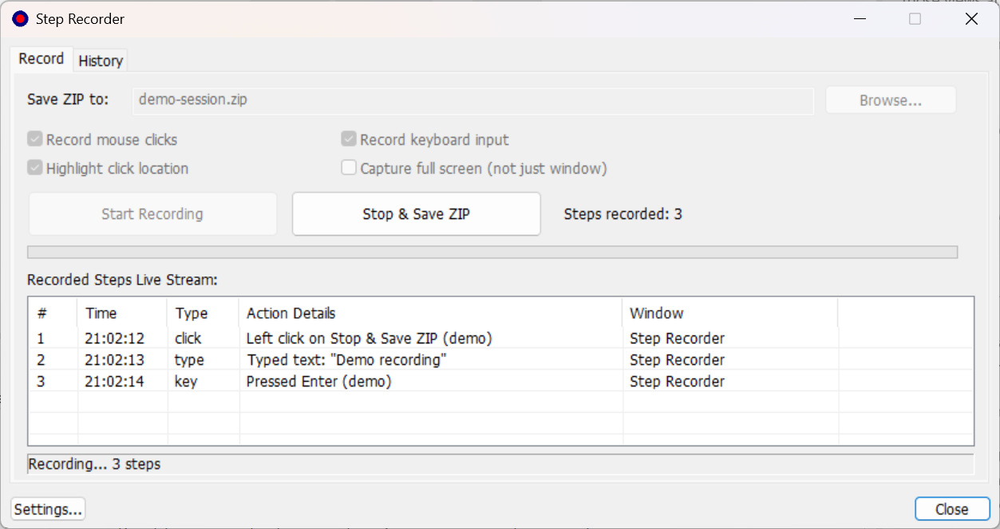
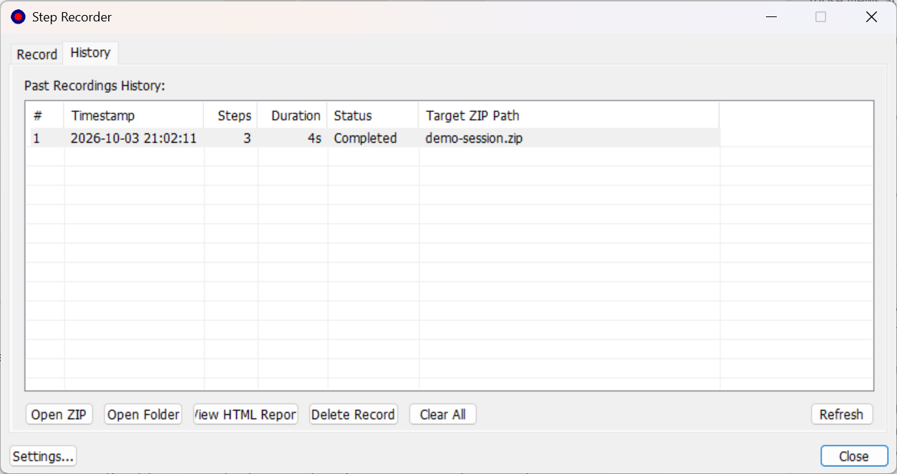
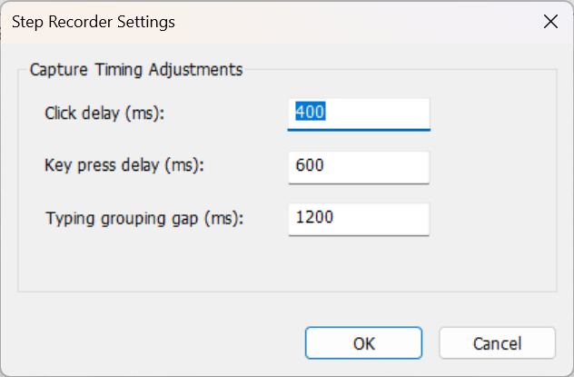
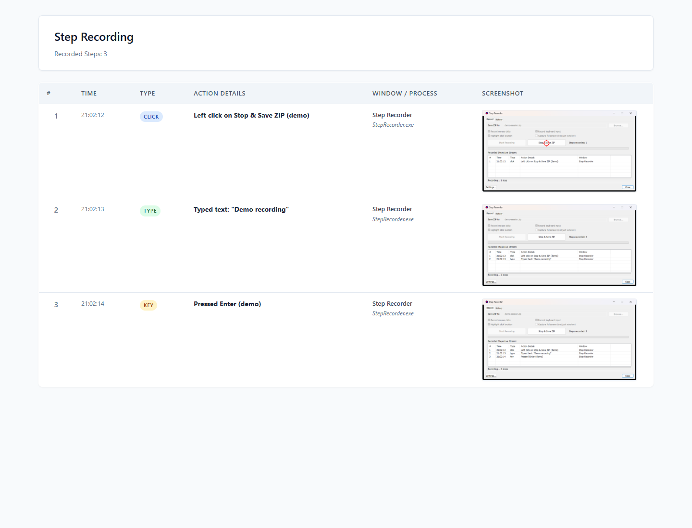

# Step Recorder (Native C++17 MFC)

A production-grade, native Windows C++17 desktop application that records step-by-step user interactions (mouse clicks, keystrokes, and window interactions) with high-fidelity visual context, generating self-contained ZIP archives containing annotated screenshots, a responsive HTML report, and structured JSON metadata.

Built in compliance with the **Native MFC Desktop Productionization Standard**:
- **Pure Native C++17**: No Electron, WebView2, Node.js, Python, or web wrappers.
- **Modern MFC Architecture**: Decoupled, multi-layer design (`Core`, `Platform`, `Services`, `App`, `Tests`).
- **High-DPI Aware**: Native PerMonitorV2 DPI awareness and Windows Common Controls 6.0.
- **Durable Persistence**: Transactional JSON history in `%LOCALAPPDATA%\StepRecorder` with crash reconciliation.
- **Isolated Workspaces**: Managed RAII temporary workspaces under `%TEMP%\StepRecorder\jobs\`.
- **Zero-Dependency Archiving**: Native PKWARE ZIP engine with standard IEEE 802.3 CRC-32 validation.

---

## Screenshots

The native Windows interface, shown with a demo recording session.

### Recording

Recording controls, capture options, and the live step feed.



### History

Saved sessions with actions to open the ZIP archive, containing folder, or HTML report.



### Settings

Configurable capture delays and the gap used to group continuous typing.



### HTML Report

The generated report includes action details and annotated screenshot previews.



---

## Architecture Overview

```
                      +---------------------------------------+
                      |       UI Layer: StepRecorderApp       |
                      |  (CWinAppEx, CMainDialog, CTabCtrl)   |
                      |   - WorkPage: Live Recording Stream   |
                      |   - HistoryPage: Session Management   |
                      |   - SettingsDialog: Delays & Timing   |
                      +-------------------+-------------------+
                                          |
                      +-------------------v-------------------+
                      |      Services Layer: Services.lib     |
                      |  - JobManager: Recording Orchestrator |
                      |  - HistoryStore: JSON Persistence     |
                      |  - ArchiveService: ZIP Extraction     |
                      +-------------------+-------------------+
                                          |
         +--------------------------------+--------------------------------+
         |                                                                 |
+--------v----------------------+                        +-----------------v------------------+
|      Core Layer: Core.lib     |                        |   Platform Layer: Platform.lib     |
| - ScreenCapture (GDI+, DWM)   |                        | - TempWorkspace (Managed Sandbox)  |
| - InputHook (WH_*_LL Hooks)   |                        | - ProcessRunner (Shell Integration)|
| - ZipWriter (PK ZIP + CRC-32) |                        | - CredentialStore (DPAPI Wrapper)  |
| - ReportGenerator (HTML/JSON) |                        +------------------------------------+
+-------------------------------+
```

Detailed architectural diagrams, sequencing, and concurrency models are documented in [docs/architecture.md](docs/architecture.md).

---

## Requirements & Prerequisites

- **Operating System**: Windows 10 (1809+) or Windows 11 (x64)
- **Compiler**: Visual Studio 2026 (v18) or Visual Studio 2022 (v17) Build Tools with:
  - MSVC C++ x64/x86 build tools (`v145` or `v143`)
  - C++ MFC for latest v14x build tools (`Microsoft.VisualStudio.Component.VC.ATLMFC`)
  - Windows 10/11 SDK (e.g. `10.0.22621.0` or higher)

Run `setup.bat` to verify all toolchains and SDK components:
```bat
setup.bat
```

---

## Quick Start (Automation Scripts)

The repository provides standardized batch and PowerShell scripts for all lifecycle tasks:

### 1. Setup & Environment Verification
```bat
setup.bat
```
Checks for MSBuild, MSVC, MFC headers (`afxwin.h`), Windows SDK, and creates required directories.

### 2. Build Solution
```bat
build.bat -Configuration Release -Platform x64
```
Compiles the static libraries (`Core.lib`, `Platform.lib`, `Services.lib`), the main application (`StepRecorder.exe`), and the test harness (`Tests.exe`).

### 3. Run Automated Tests
```bat
test.bat -Configuration Release -Platform x64
```
Executes the 17-case unit test suite (`Tests.exe`), the application self-test (`StepRecorder.exe --selftest`), and dialog lifecycle checks with command-driven controls, real mouse Start/Stop clicks, held-button startup, input/screenshot capture, restart, and closing. Test runs use bounded waits and restore the original recording history, pointer, and foreground window afterward. See [verification results](docs/verification.md) for the tested cases and reproduced freeze diagnosis.

### 4. Run Application
```bat
run.bat -Configuration Release -Platform x64
```
Launches the native MFC graphical interface.

To run headless self-test directly:
```bat
run.bat -Configuration Release -Platform x64 --selftest
```

### 5. Package Release Distribution
```bat
package.bat -Configuration Release -Platform x64
```
Packages production binaries, sample configuration, and notices into `dist/StepRecorder-Release-x64.zip`.

### 6. Automated GitHub Releases

The [Build and release workflow](.github/workflows/release.yml) builds and tests the Windows x64 Release configuration on every push to `main`. You can also run it from **Actions → Build and release → Run workflow**, selecting the branch to release.

After the unit tests and application self-test pass, the workflow publishes a GitHub release with a tag and title in `YYYY.mm.ddhhmm` format, using UTC and 24-hour time. For example, `2026.10.031430` represents October 3, 2026 at 14:30 UTC. Each release includes:

- `StepRecorder-2026.10.031430-x64.exe`: the application executable.
- `StepRecorder-2026.10.031430-x64.zip`: the executable, README, sample configuration, and third-party notices.

Install the [latest x64 Microsoft Visual C++ Redistributable](https://aka.ms/vc14/vc_redist.x64.exe) before running the application. The workflow uses the repository's built-in `GITHUB_TOKEN`; no extra release secret is needed. Release runs are serialized, and an existing timestamp is never overwritten. If the timestamp is already in use, retry in a later UTC minute. Interactive dialog lifecycle tests remain available through `test.bat` locally.

---

## Features & Capabilities

- **Delayed Visual Screenshot Capture**: Asynchronously captures frames with a configurable delay (default: 150ms) to allow transient Windows animations, context menus, and hover states to settle.
- **Accurate Window Bounding**: Uses DWM Extended Frame Bounds (`DwmGetWindowAttribute`) to clip window screenshots precisely without Aero drop shadows.
- **Multi-Monitor Coordinate Normalization**: Fully supports virtual desktops spanning multiple displays, properly normalizing negative monitor coordinates.
- **Click Highlight Overlays**: Renders high-visibility concentric rings and crosshairs on mouse click coordinates.
- **Keyboard Input Decoding & Typing Aggregation**: Translates virtual keys to readable labels and coalesces continuous typing into coherent "Type text" events.
- **Interactive Multi-Tab Dashboard**:
  - **Work Page**: Start/Stop controls, real-time timer, step counter, live event feed, and destination selection.
  - **History Page**: Searchable table of past recording sessions with options to open the ZIP, browse the containing folder, view the HTML report directly in the default browser, or delete entries.
- **Self-Healing Crash Reconciliation**: Automatically recovers unfinished recordings from previous crashes or power failures, safely marking them as `Interrupted`.
- **Standalone Self-Test Mode**: Supports `--selftest` CLI flag for headless validation in continuous integration (CI) environments without interactive input dependencies.

For a comprehensive feature comparison with the legacy prototype, refer to [docs/feature-parity.md](docs/feature-parity.md).

---

## Repository Structure

```
step-to-step-record/
├── .vsconfig                     # Visual Studio installer component requirements
├── config.example.json           # Sample runtime configuration
├── THIRD_PARTY_NOTICES.md        # Open-source and third-party notices
├── secrets.md                    # Pillar 6 Security & Secrets Audit report
│
├── setup.bat / setup.ps1         # Environment & toolchain verification
├── build.bat / scripts/build.ps1 # MSBuild build automation
├── test.bat / scripts/test.ps1   # Unit test & self-test automation
├── run.bat / scripts/run.ps1     # Application launcher
├── package.bat / scripts/package.ps1 # Release packaging
│
├── screenshot/                  # Native UI and generated report screenshots
│
├── docs/
│   ├── architecture.md           # System architecture, layers, & threading
│   ├── feature-parity.md         # Prototype vs production parity matrix
│   ├── migration-notes.md        # Design decisions & refactoring history
│   └── verification.md           # Test execution report & benchmarks
│
└── cpp/
    ├── Directory.Build.props      # Unified MSVC compiler & linker rules
    ├── StepRecorder.sln          # Master Visual Studio solution
    ├── core/                     # Core.lib: Capture, Hooks, Zip, Reports
    ├── platform/                 # Platform.lib: Workspaces, Shell, DPAPI
    ├── services/                 # Services.lib: JobManager, HistoryStore
    ├── resources/                # Dialog templates, icons, manifests
    ├── app/                      # StepRecorder.exe: MFC Application
    └── tests/                    # Tests.exe: Automated Test Harness
```

---

## Documentation Links

- [Architecture Specification](docs/architecture.md)
- [Feature Parity Matrix](docs/feature-parity.md)
- [Migration & Modernization Notes](docs/migration-notes.md)
- [Verification & Test Report](docs/verification.md)
- [Security & Secrets Audit](secrets.md)

---

## License

This project is licensed under the MIT License - see the [LICENSE](LICENSE) file for details.
